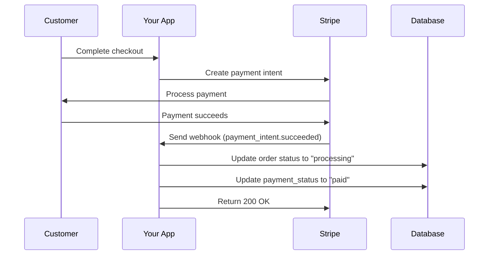

# Stripe Webhook Setup Guide

This guide will help you set up Stripe webhooks to automatically update order payment status in your database when payments succeed or fail.

## Why Webhooks Are Needed

When a customer completes payment, your application needs to:

1. Update the order status from "pending" to "processing"
2. Change payment status from "pending" to "paid"
3. Trigger any post-payment processes (emails, inventory updates, etc.)

Webhooks ensure this happens reliably, even if the customer closes their browser before returning to your site.

## Step 1: Create Webhook Endpoint in Stripe Dashboard

### 1.1 Access Stripe Dashboard

1. Go to [Stripe Dashboard](https://dashboard.stripe.com/)
2. Navigate to **Developers** → **Webhooks**
3. Click **"Add endpoint"**

### 1.2 Configure Webhook URL

**For Development (localhost):**

```url
http://localhost:3000/api/webhooks/stripe
```

**For Production:**

```url
https://yourdomain.com/api/webhooks/stripe
```

> **Note**: For localhost testing, you'll need to use Stripe CLI for forwarding (see Step 3)

### 1.3 Select Events

You're currently on the "Select events" step. Choose these specific events:

#### Required Events:
- ✅ `payment_intent.succeeded` - When payment completes successfully
- ✅ `payment_intent.payment_failed` - When payment fails

#### Optional Events (for enhanced functionality):
- `payment_intent.canceled` - When payment is canceled
- `payment_intent.requires_action` - When additional authentication needed
- `charge.dispute.created` - When customer disputes a charge

### 1.4 Event Selection Process:
1. Click **"Select events"** 
2. Search for "payment_intent"
3. Select the checkboxes for:
   - `payment_intent.succeeded`
   - `payment_intent.payment_failed`
4. Click **"Add events"**

### 1.5 Choose Destination Type
- Select **"Connect to your server"** (not Connect applications)

### 1.6 Configure Your Destination  
- **Endpoint URL**: Enter your webhook URL from step 1.2
- **Description**: "Order payment status updates"
- Click **"Add endpoint"**

## Step 2: Get Your Webhook Secret

After creating the webhook:

1. Click on your newly created webhook endpoint
2. In the **"Signing secret"** section, click **"Reveal"**
3. Copy the webhook secret (starts with `whsec_`)
4. Add it to your `.env.local` file:

```env
# Add this to your .env.local file
STRIPE_WEBHOOK_SECRET=whsec_your_secret_key_here
```

## Step 3: Local Development Setup (Stripe CLI)

For testing webhooks locally, use Stripe CLI:

### 3.1 Install Stripe CLI
```bash
# macOS (using Homebrew)
brew install stripe/stripe-cli/stripe

# Or download from: https://github.com/stripe/stripe-cli/releases
```

### 3.2 Login to Stripe CLI
```bash
stripe login
```

### 3.3 Forward Webhooks to Localhost
```bash
stripe listen --forward-to localhost:3000/api/webhooks/stripe
```

This will output a webhook secret like:
```
whsec_1234567890abcdef...
```

Use this secret in your `.env.local` for development.

## Step 4: Environment Variables Setup

Add these to your `.env.local` file:

```env
# Stripe Configuration
NEXT_PUBLIC_STRIPE_PUBLISHABLE_KEY=pk_test_...
STRIPE_SECRET_KEY=sk_test_...

# Webhook Secret (from Step 2 or 3)
STRIPE_WEBHOOK_SECRET=whsec_...

# Optional: Webhook URL (for reference)
STRIPE_WEBHOOK_URL=http://localhost:3000/api/webhooks/stripe
```

## Step 5: Test Your Webhook

### 5.1 Test Payment Flow
1. Start your development server: `npm run dev`
2. If using Stripe CLI: Run `stripe listen --forward-to localhost:3000/api/webhooks/stripe` in another terminal
3. Make a test purchase through your checkout
4. Check your console logs for webhook receipt

### 5.2 Verify Database Updates
After a successful test payment, check your database:

```sql
-- Check if order status was updated
SELECT order_number, status, payment_status, created_at 
FROM orders 
ORDER BY created_at DESC 
LIMIT 5;
```

You should see:
- `status` changed from "pending" to "processing"
- `payment_status` changed from "pending" to "paid"

### 5.3 Test with Stripe CLI (Alternative)
```bash
# Trigger a test webhook event
stripe trigger payment_intent.succeeded
```

## Step 6: Production Deployment

### 6.1 Update Webhook URL
1. Go back to Stripe Dashboard → Webhooks
2. Edit your webhook endpoint
3. Update URL to your production domain:
   ```
   https://yourdomain.com/api/webhooks/stripe
   ```

### 6.2 Production Environment Variables
Ensure your production environment has:
```env
STRIPE_SECRET_KEY=sk_live_...  # Live secret key
STRIPE_WEBHOOK_SECRET=whsec_... # Production webhook secret
```

### 6.3 SSL Certificate
- Stripe requires HTTPS for production webhooks
- Verify your SSL certificate is properly configured

## Troubleshooting

### Common Issues:

#### 1. "Webhook signature verification failed"
- **Cause**: Wrong webhook secret
- **Solution**: Double-check `STRIPE_WEBHOOK_SECRET` in `.env.local`

#### 2. "Connection timeout" 
- **Cause**: Server not responding or wrong URL
- **Solution**: Verify webhook URL and server status

#### 3. "No such payment_intent"
- **Cause**: Database lookup failing
- **Solution**: Check `stripe_payment_intent_id` field in orders table

#### 4. "Headers not found" error
- **Cause**: Fixed in your current code
- **Solution**: Ensure you're using `await headers()` in webhook route

### Debugging Tips:

#### 1. Enable Webhook Logs
```typescript
// Add to your webhook route for debugging
console.log('Webhook received:', {
  type: event.type,
  id: event.id,
  payment_intent: event.data.object.id
});
```

#### 2. Check Stripe Dashboard
- Go to Webhooks → Your endpoint → Attempt logs
- Review failed attempts and error messages

#### 3. Test with curl
```bash
# Test webhook endpoint manually
curl -X POST http://localhost:3000/api/webhooks/stripe \
  -H "Content-Type: application/json" \
  -d '{"test": true}'
```

## Webhook Event Flow

Here's what happens when a payment succeeds:



## Security Best Practices

1. **Always verify webhook signatures** (already implemented)
2. **Use HTTPS in production** (required by Stripe)
3. **Handle idempotency** - webhooks may be sent multiple times
4. **Return 200 status quickly** - avoid timeouts
5. **Log webhook events** for debugging and monitoring

## Next Steps

After webhook setup:
1. ✅ Test the complete payment flow
2. ✅ Verify order status updates in admin panel
3. ✅ Monitor webhook delivery in Stripe Dashboard
4. 🔄 Set up email notifications for successful orders
5. 🔄 Implement inventory management triggers
6. 🔄 Add order confirmation emails

Your webhook is now configured to keep your order management system in sync with Stripe payment events!